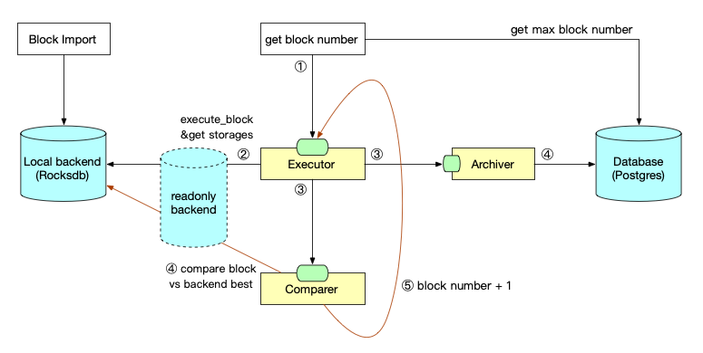

## Run

```
cd patract-archive
# export genesis json file and archive config file to env
export ARCHIVE_JSON=$(pwd)/bin/archive/cli/res/dot.json
export ARCHIVE_CONFIG="$(pwd)/archive.toml"
cargo run -- -d /tmp/dot00
```

## Arch

v0.2 arch:

1. get block number from cmd or database
2. Executor begin execute block and get storage changes
3. send data to Archiver and send block number to Comparer
4. Archiver write data to db and mq, Comparer compare block with backend's best block number
5. if current block number less than best, put next block number to Executor



## dependency:

- client/archive/postgres

```text
#sqlx = { version = "0.5", features = ["postgres", "runtime-tokio-rustls", "json"] }
#sqlx = { version = "0.5", features = ["postgres", "runtime-tokio-native-tls", "json"] }
sqlx = { version = "0.5", features = ["postgres", "runtime-async-std-native-tls", "json"] }
```

- client/archive/kafka

```text
replace sp-core="3.0.0" to github
```

## todo list

- [ ] batch when sync catch up
- [ ] backend impl#2: local secondary backend
- [ ] backend impl#3: use remote db to get storages
- [ ] backend adapter
- [ ] block get#2: rpc